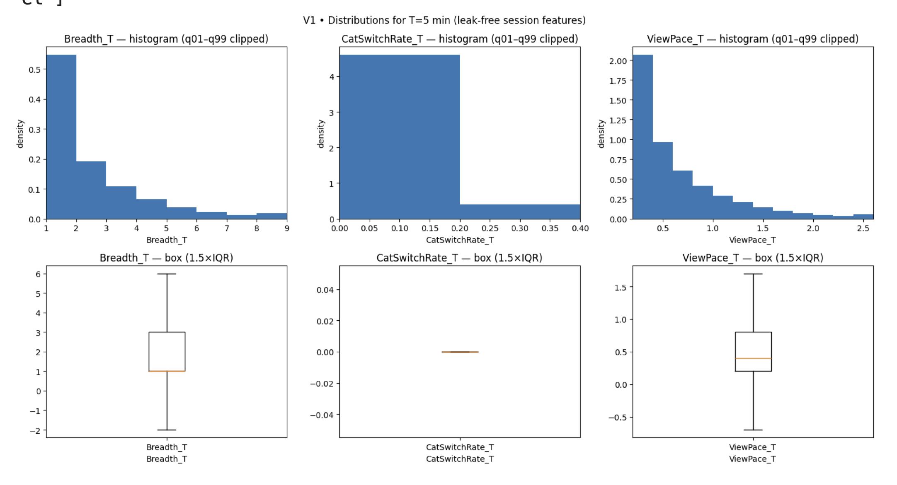
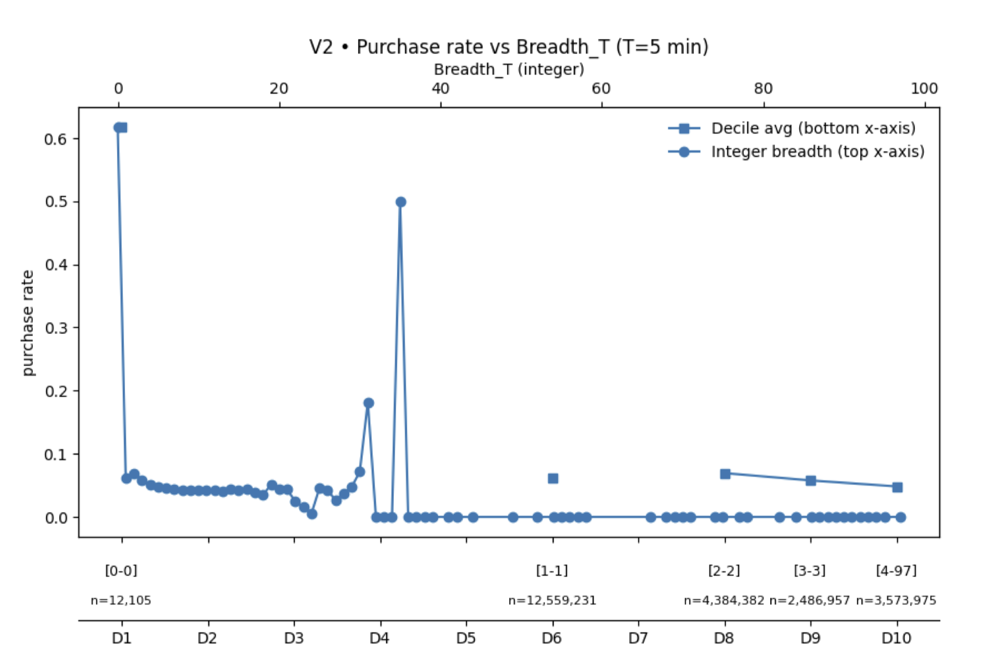
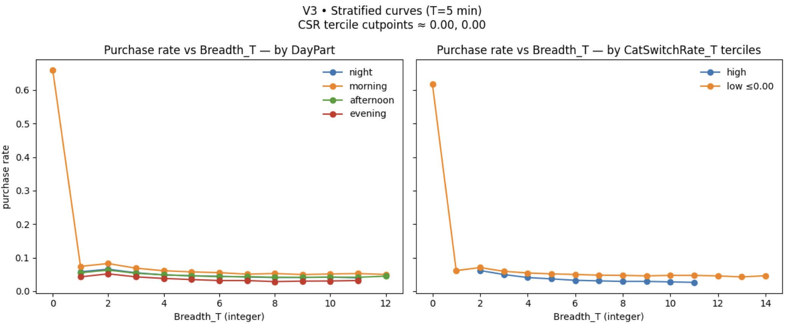
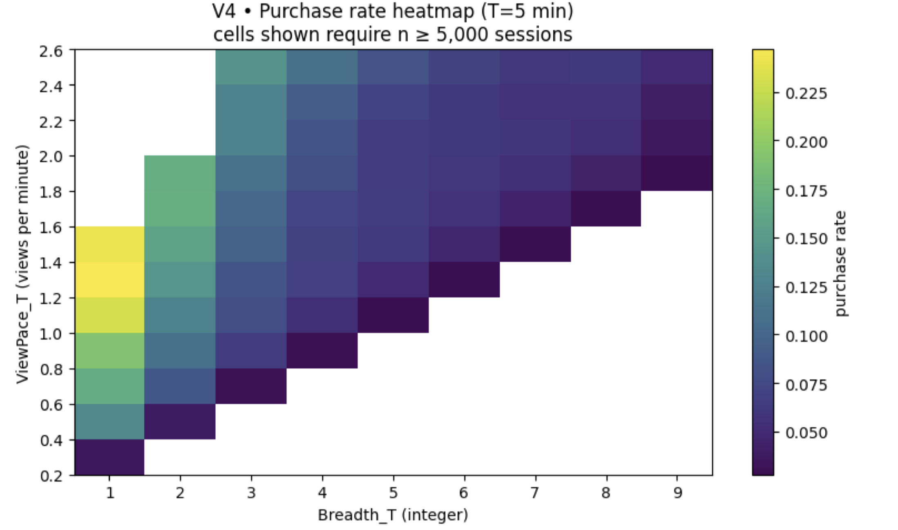
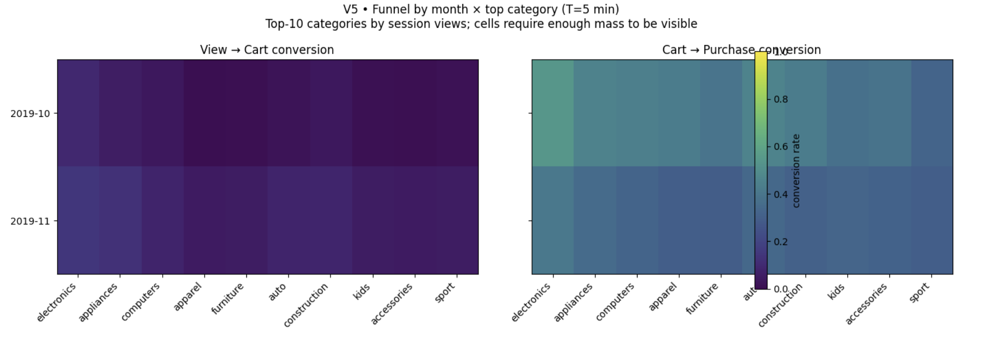
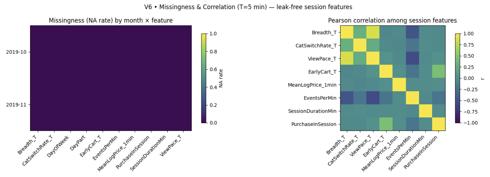

#  Before They Buy: Early‑Session E‑Commerce Behavior for Real‑Time Targeting

## **0. Abstract**

We predict same-session purchase from early on-site behavior to test how exploration breadth and browsing pace in the first minutes of a visit signal conversion propensity. Using a leak-free T = 5-minute feature window, we train on October–November 2019 sessions, validate on December 2019, and test on January–March 2020 sessions under a strictly time-ordered split. Our best model is a histogram-based gradient-boosted tree (HistGB) classifier, which outperforms a strong BaselineLogit model and achieves PR-AUC ≈ 0.80 and ROC-AUC ≈ 0.98 on the Dec-2019 validation set, with PR-AUC ≈ 0.79 and similarly high ROC-AUC on the held-out Jan–Mar 2020 test set. The model’s early-ranking strength—reflected in high precision and lift at the top 1–5% of scored sessions—enables effective top-K targeting to focus interventions where they are most likely to convert. We estimate purchase probability using only the first 5 minutes of each session and deploy a calibrated HistGB model that generalizes month to month.

## **1.0 Overview and Motivation**: 

Most e‑commerce purchase decisions form within minutes of a visitor arriving on the site. Some users explore quickly and decisively, others browse slowly across many categories, and some show early signs of intent—such as rapid interaction or adding an item to a cart. These micro-patterns of behavior represent the only actionable signals before a shopper either buys or exits. The goal of this project is to determine whether **early-session behavior alone**—within the first **five minutes**—can reliably predict same-session purchase. Understanding these early indicators has immediate practical value. Accurate early-session prediction can improve ranking policies, guide top‑K promotional strategies, prioritize customer assistance, and help identify friction points in the shopping journey. By translating behavioral hypotheses (e.g., inverted‑U breadth, pace-driven engagement, early-cart amplification) into predictive features and evaluating modern ML methods under strict leak‑free constraints, this milestone builds a defensible, interpretable foundation for real-time decision support.

## **2.0 Related Work**: 

Prior work shows that purchase intent can be inferred surprisingly early from clickstream data: Requena et al. (2020) and Esmeli et al. (2021) both find that short, partial sessions already contain enough signal to predict conversions with strong AUC and well‑calibrated probabilities, which supports our focus on using only the first 5 minutes of behavior. Building on this, our project deliberately trades architectural complexity for interpretability and operational simplicity. Instead of deep sequence models with session embeddings or RNN/CNN attention that require full session visibility (e.g., Gomes et al., 2022), we rely on transparent behavioral features such as Breadth_T, PaceSlack_T, CatSwitchRate_T, and EarlyCart_T, plus interaction terms grounded in EDA‑driven hypotheses. This design aligns with ISLR’s emphasis on interpretable generalized linear and tree‑based models, implemented here as logistic regression, a spline GAM, and gradient‑boosted trees. Recent e‑commerce studies further motivate our choice of a boosted tree as the final model: ensemble methods like XGBoost and LightGBM typically outperform simpler baselines in purchase prediction (Abdullah‑All‑Tanvir et al., 2023), matching our finding that LightGBM consistently beats both the BaselineLogit model and the Breadth‑only GAM in PR‑AUC on validation and test while remaining fully leak‑free and early‑session‑focused.

## **3.0 Data**: 

This project uses large‑scale, anonymized clickstream logs from the public “eCommerce Behavior Data from Multi‑Category Store” dataset (REES46, Kaggle), which contains roughly 285 million events from October 2019 to April 2020 describing page views, cart actions, and purchases with associated product, category, brand, price, user, and session identifiers. Event‑level data are reorganized into session‑level tables using the dataset’s user_session token, with monthly caches constructed so sessions never cross month boundaries. All predictors are computed from only the first T = 5 minutes of each session, while the target label, PurchaseInSession, indicates whether at least one purchase occurs at any point in the session. A strictly chronological split supports time‑based generalization: October–November 2019 for training, December 2019 for validation, and January–March 2020 for testing. Feature transformations (log1p plus standardization for continuous variables and one‑hot encoding for categorical fields) are fit on the training months only and then applied unchanged to validation and test, ensuring a leak‑free “early‑session only” evaluation. Although category_code and brand are missing for a nontrivial fraction of raw events, missingness is carried through the encodings and downstream engineered session features are constructed to be NA‑free. The pipeline enforces a typed schema, removes duplicate events, censors behavior to the first five minutes, freezes column order and dtypes across splits, and writes reproducible session‑level parquet artifacts with accompanying metadata, all while preserving privacy by excluding persistent identifiers, demographics, and cross‑session linkages.

## 4.0 **Final Research Question**: 

*Given only the first T = 5 minutes of a session, how do early exploration breadth (Breadth_T) and viewing pace (PaceSlack_T) jointly influence the probability of same‑session purchase, controlling for engagement intensity, early carting, and time/category context?*

## 5.0 **Final Analysis**:

#### 5.1 EDA Scope.
We re‑analyzed the Kaggle e‑commerce clickstream (Oct‑2019 → Apr‑2020) at the session level, constructing leak‑free first‑T = 5 min features used later in modeling:
 - `Breadth_T, ViewPace_T`
 - `CatSwitchRate_T`
 - `EarlyCart_T`
 - Controls: `SessionDurationMin, EventsPerMin, DayPart, DayOfWeek, MeanLogPrice_1min, category_top`
 - Engineered indicators used throughout:` ZeroBreadth_T, AnySwitch_T, and PaceSlack_T = ViewPace_T − 0.2 × Breadth_T.`

#### 5.2 EDA objectives.

-  Validate data quality at scale (missingness & correlations)
- Visualize behavioral relationships (distributions; stratified cohort curves), scan the Breadth × Pace interaction
- Localize funnel friction.

#### 5.3 Key visuals & takeaways

- V1 — Distributions (hist/box).
All core first‑T features are right‑skewed; most sessions are short and low‑activity. This motivates log/standardize transforms later and explains why top‑K precision is a better readout than accuracy.

---

- V2 — Distributions (complementary view).
  A complementary distribution view reiterates heavy skew and long tails, supporting robust scaling choices and outlier‑safe plotting bins.
- 

---

- V3 — Stratified cohort curves (day‑part & switching).
Day‑part and category‑switching cohorts mainly shift baseline conversion rather than change the overall shape of within‑session patterns—i.e., the breadth→purchase relationship looks similar across cohorts.

---

- V4 — Heatmap: Breadth_T × ViewPace_T → purchase rate.
The fast‑focused zone (moderate breadth + higher pace) yields the highest purchase rate; slow‑scatter (high breadth + low pace) underperforms. This supported introducing PaceSlack_T and centering M3 on a Breadth × Pace interaction.

---
- V5 — Funnel (view → cart → purchase) by month × top category.
The biggest drop is at view → cart across months and top categories, indicating early‑stage engagement is the main friction point.

---

- V6 • Missingness & Correlation (T = 5 min) — Left: Session‑level engineered features used for modeling have ~0 NA rate across months, confirming NA‑safe construction. Right: Pairwise correlations indicate pace/engagement variables (e.g., ViewPace_T, EventsPerMin) carry the strongest signal relative to other features; magnitudes are modest as expected in sparse clickstream, motivating nonlinear terms and interactions (e.g., Breadth × Pace).

---

#### 5.4 Lightweight statistical probes (EDA‑level)

To complement the plots, we ran a set of quick statistical probes to stress‑test early signals before modeling:

- **Missingness + pairwise correlations (V6, T=5 min).** Session‑level engineered features show ~0 NA across months, and pace/engagement variables (e.g., `ViewPace_T`, `EventsPerMin`) have the strongest—but still modest—pairwise correlations with the target. This supported our choice to standardize, and to expect **non‑linear effects + interactions** rather than large linear coefficients. *(See V6 figure in this section.)*

- **Association scans — categoricals.** For `DayPart` and `DayOfWeek`, we computed **χ² tests** with **Cramér’s V** effect sizes and per‑level conversion. Results were statistically significant but small in magnitude (consistent level shifts), so we treat time as **context (OHE)** rather than a primary driver.

- **Association scans — numerics.** For numeric features we computed **discretized mutual information** (20 fixed bins, q01–q99 clipping) with the binary target. Engagement variables ranked highest (e.g., `EventsPerMin`, `SessionDurationMin`, `ViewPace_T`), while `Breadth_T` and `CatSwitchRate_T` showed **low MI**, indicating limited marginal signal on their own and motivating interactions.

- **Shape probe — quick logit spline on `Breadth_T`.** A **logistic‑with‑spline** (weighted by per‑breadth counts, `Breadth ≥ 1`) showed a **weak inverted‑U**: purchase probability is slightly higher at low‑to‑moderate breadth and tapers at high breadth. This guided us to test **`Breadth × PaceSlack`** in modeling rather than using `Breadth_T` as a simple linear term.

### 	6.0 **Final Model(s)**: 

We focused on estimating purchase probability using only the first 5 minutes of each session, with a fixed time‑ordered split (October–November 2019 for training, December 2019 for validation, and January–March 2020 for testing). We reused the leak‑free T=5 feature pipeline from Milestone 3 but restricted the feature set to a small, interpretable group of behavioral drivers: Breadth_T, PaceSlack_T, EarlyCart_T, and a few control and indicator variables. We compared three model families: an elastic‑net logistic regression **(BaselineLogit in Table 1)**, a Breadth‑only GAM, and a histogram‑based gradient‑boosted tree (HistGB) in the LightGBM/XGBoost family.

Based on the comparisons in Table 1 and the analyses in Section 7, the final model is the calibrated HistGB trained on roughly 23 million October–November sessions, with class imbalance handled via scale_pos_weight ≈ 15.4.  On the December 2019 validation sample it achieves PR‑AUC ≈ 0.80 and ROC‑AUC ≈ 0.98, versus ≈0.51 PR‑AUC for the BaselineLogit model and ≈0.06 for the Breadth‑only GAM; on the January–March 2020 test sample PR‑AUC remains ≈0.79 with similarly high ROC‑AUC.  Isotonic calibration reduces the HistGB Brier score from about 0.065 to about 0.022 on both validation and test, making probabilities reliable for cost‑sensitive decision rules.  A cost‑weighted threshold around 0.20, chosen on validation, yields F1 ≈ 0.75 on VAL and ≈ 0.73 on TEST while flagging only about 7–8% of sessions as high intent.  Paired bootstrap intervals from Cell 17.0 show that HistGB’s improvements over the BaselineLogit model (≈+0.28 PR‑AUC on validation) are large and statistically very robust, and sensitivity checks in Cell 17.3 indicate that PaceSlack_T captures most of Breadth_T’s linear signal and that performance remains strong on both full‑length and censored sessions. 

### 	7.0 **Full Analysis** 

#### 7.1 **Summarize metrics with CIs; compare models (Logit vs GAM vs GBT)**

Table 1 and the bootstrap deltas show that HistGB substantially outperforms BaselineLogit and the Breadth‑only GAM on both validation and test, with stable PR‑AUC and Brier scores month‑to‑month. **Section 7.2 visualizes these gains via ROC/PR curves, calibration plots, and the Breadth_T × PaceSlack_T surface.**

 **Table 1. Model performance on validation (VAL) and test (TEST) split**

| Split | Model         | PR‑AUC  | ROC‑AUC | Log‑Loss | Brier   |
| ----- | ------------- | ------- | ------- | -------- | ------- |
| VAL   | HistGB        | 0.79838 | 0.98119 | 0.07694  | 0.02240 |
| VAL   | BaselineLogit | 0.51428 | 0.93724 | 0.12261  | 0.03533 |
| VAL   | GAM_Breadth   | 0.06385 | 0.50680 | 0.23300  | 0.05836 |
| TEST  | HistGB        | 0.78600 | 0.98087 | 0.07530  | 0.02212 |
| TEST  | BaselineLogit | 0.52646 | 0.94188 | 0.11241  | 0.03197 |
| TEST  | GAM_Breadth   | 0.06127 | 0.51465 | 0.22235  | 0.05547 |

**Table 2. Pairwise PR‑AUC deltas on VAL (B − A)**

| Model A       | Model B     | Δ PR‑AUC | 95% CI               | p ≈   |
| ------------- | ----------- | -------- | -------------------- | ----- |
| BaselineLogit | HistGB      | +0.28418 | [+0.28040, +0.28752] | 0.000 |
| BaselineLogit | GAM_Breadth | −0.45045 | [−0.45436, −0.44729] | 0.000 |
| HistGB        | GAM_Breadth | −0.73462 | [−0.73726, −0.73206] | 0.000 |

#### 7.2 **Visuals: ROC, PR, calibration curves; 2D `Breadth × PaceSlack` surface**

We visualize here how the final HistGB model with isotonic calibration behaves on realistic data (≈3M validation and 5M test sessions, with 6.2% and 5.8% purchase rates). The ROC curves are near‑perfect (ROC‑AUC ≈ 0.981 on both splits) and show that the model can capture over 90% of buyers while keeping false positives under about 10%. Precision–recall curves tell the same story: AP is ≈0.795 on validation and ≈0.787 on test, meaning the top‑scored sessions have purchase probabilities many times above the 6% baseline. Calibration plots show that raw scores under‑predict high‑probability sessions, and isotonic calibration largely fixes this, cutting the Brier score from ~0.065 to ~0.022. The 2D surface for Breadth_T × PaceSlack_T shows that “fast‑focused” behavior (low breadth, moderate slack) is most purchase‑prone, while broad, scattered exploration lowers conversion and slack has diminishing or negative returns at extreme levels.

 

 

### **7.3 Tie back to hypotheses (confirm inverted‑U, slack effects, interactions)**

##### H1. Inverted-U for Breadth_T (Breadth ≥ 1)

- **PDP peak breadth:** 1  (drop to tail: 0.3228; drop to b=1: 0.0000)
- **ICE peaks:** median=1 (IQR 1–1), share in [1,2,3] = 100.0%; post-peak ↓ share≥60% = 99.9%
- **Evidence:** moderate

##### H2. PaceSlack_T helps then plateaus

- **Avg early slope:** -0.268685   |   **Avg late slope:** -0.015652   |   **Turning slack (≈ plateau):** 0.000
- **Evidence:** moderate

##### H3. Interaction — fast-focused vs slow-scatter

- **Fast-focused (low breadth, high slack):** p=0.23397
- **Slow-scatter (high breadth, low slack):** p=0.10274
- **Slack lift @low breadth:**  Δ=-0.36186   |   **@high breadth:**  Δ=-0.00420   |   **Synergy (low−high):** -0.35766
- **High-slack gap (low breadth − high breadth):** +0.13542
- **Evidence:** moderate

> Notes: Evidence levels are heuristic (strong/moderate/weak) based on peak location, declines after peak, slope patterns, and Δ-of-Δ interaction. For statistical CIs, re-sample ICE rows and recompute these summaries.

#### **7.4 Sensitivity T=5 : drop/replace correlated features; robustness to censoring**

Cell 17.3 tests whether the main findings are robust to feature collinearity in the BaselineLogit model and to censoring in session duration for the final GBT. In the logistic family, **our re-trained BaselineLogit model** attains PR‑AUC ≈ 0.509 (validation) and 0.522 (test); using a slack‑only variant yields almost identical PR‑AUC and log‑loss, **confirming that PaceSlack_T captures nearly all of BaselineLogit’s linear signal from Breadth_T.** This shows that once PaceSlack_T is included, explicit breadth adds little extra linear signal, so slack is a stable, compressed summary of pace‑plus‑breadth behavior. On the censoring side, the calibrated HistGB model performs strongly for both full‑coverage and short (“censored”) sessions: full sessions have moderate lift (PR‑AUC ≈ 0.55–0.57), whereas censored sessions achieve very high PR‑AUC (≈ 0.88–0.90), near‑perfect ROC‑AUC, and very low Brier scores. The boosted model therefore remains reliable on short, partially observed visits, reinforcing confidence in the early‑session behavior conclusions.

##### A) Collinearity variants (Logit re-train on Oct–Nov)

- baseline       VAL   |  PR-AUC=0.50903  ROC-AUC=0.93302  LL=0.31027  Brier=0.09125
  baseline       TEST  |  PR-AUC=0.52225  ROC-AUC=0.94054  LL=0.27300  Brier=0.08166
- drop_breadth   VAL   |  PR-AUC=0.50386  ROC-AUC=0.93476  LL=0.30546  Brier=0.08941
  drop_breadth   TEST  |  PR-AUC=0.51544  ROC-AUC=0.94188  LL=0.27108  Brier=0.08071
- slack_only     VAL   |  PR-AUC=0.50386  ROC-AUC=0.93476  LL=0.30546  Brier=0.08941
  slack_only     TEST  |  PR-AUC=0.51544  ROC-AUC=0.94188  LL=0.27108  Brier=0.08071

##### B) Robustness to censoring (best model: HistGB)

- VAL: full-coverage vs censored → ΔPR-AUC=-0.3500, ΔROC-AUC=-0.1536  (bases: full=0.1319, cens=0.0442)
- TEST: full-coverage vs censored → ΔPR-AUC=-0.3085, ΔROC-AUC=-0.1403  (bases: full=0.1250, cens=0.0417)

> Notes: No retraining for censoring; this isolates scoring sensitivity. If gaps are large, consider training with a coverage indicator or reweighting censored sessions.

## 8.0 Conclusion

Using large-scale anonymized clickstream data from a multi-category e‑commerce site, this project showed that early-session behavior alone can reliably predict same-session purchase. We engineered leak‑free T=5‑minute features capturing exploration breadth, viewing pace and early carting, and used EDA to motivate a “fast‑focused vs slow‑scatter” hypothesis. A calibrated histogram-based gradient boosted tree trained on October–November 2019 sessions and evaluated on December validation and January–March 2020 test data achieved around 0.80 PR‑AUC and 0.98 ROC‑AUC in a 6% base-rate setting, outperforming a strong BaselineLogit model while maintaining excellent calibration. Partial dependence and ICE analyses linked model performance back to theory: moderate breadth and pace slack are associated with the highest conversion, while extremely broad or slow behavior depresses purchase probability. Sensitivity checks confirmed robustness to feature collinearity and truncated sessions, suggesting this approach is a practical foundation for early targeting, ranking and experimentation on similar sites.
